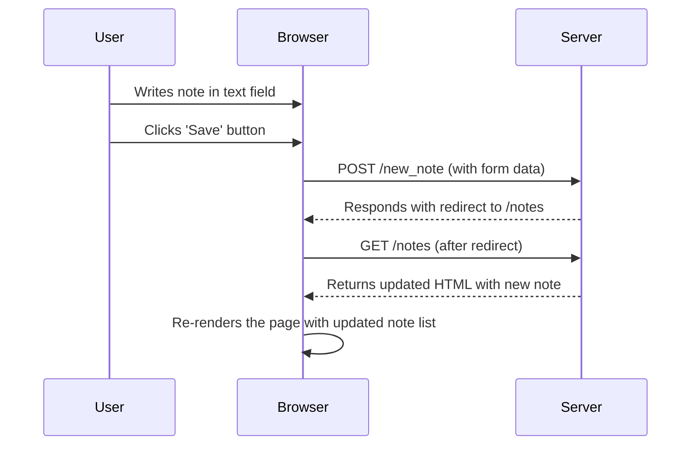

```mermaid
sequenceDiagram
    participant User
    participant Browser
    participant Server

    User->>Browser: Writes note in text field
    User->>Browser: Clicks 'Save' button
    Browser->>Server: POST /new_note (with form data)
    Server-->>Browser: Responds with redirect to /notes
    Browser->>Server: GET /notes (after redirect)
    Server-->>Browser: Returns updated HTML with new note
    Browser->>Browser: Re-renders the page with updated note list

```