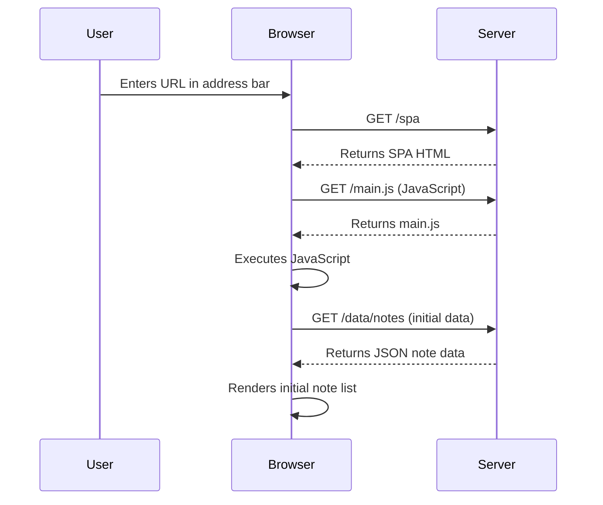

```mermaid
 sequenceDiagram
    participant User
    participant Browser
    participant Server

    User->>Browser: Enters URL in address bar
    Browser->>Server: GET /spa
    Server-->>Browser: Returns SPA HTML
    Browser->>Server: GET /main.js (JavaScript)
    Server-->>Browser: Returns main.js
    Browser->>Browser: Executes JavaScript
    Browser->>Server: GET /data/notes (initial data)
    Server-->>Browser: Returns JSON note data
    Browser->>Browser: Renders initial note list
```